# Kubernetes Architecture Icons

An K8s and Cloud-Native icon set for building cloud-native architecture diagrams

## Cluster and Node Management

<table>
  <tr>
    <td align="center"><a href="#"> <b>Cluster</b></a> </td>
    <td align="center"><a href="#">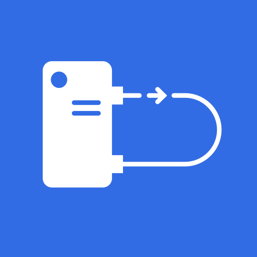 <b>Controller Manager</b></a> </td>
    <td align="center"><a href="#">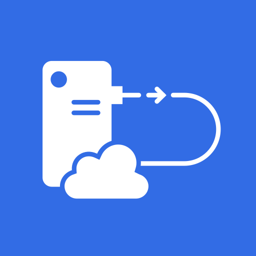 <b>Cloud Controller Manager</b></a> </td>
    <td align="center"><a href="#"> <b>Control Plane Node</b></a> </td>
    <td align="center"><a href="#"> <b>Worker Node</b></a> </td>
    <td align="center"><a href="#"> <b>Custom Resource Defintion</b></a> </td>
    <td align="center"><a href="#"> <b>Namespace</b></a> </td>
    <td align="center"><a href="#">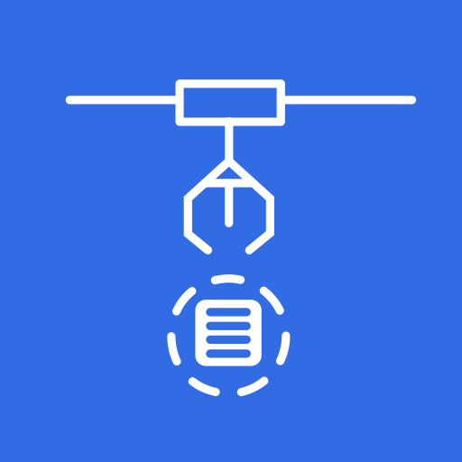 <b>Scheduler</b></a> </td>
  </tr>
</table>

## API

<table>
  <tr>
    <td align="center"><a href="#">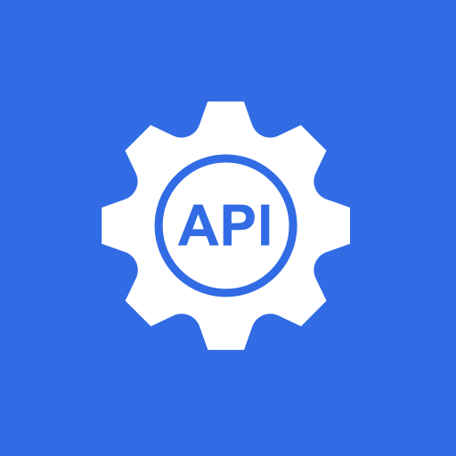 <b>API Server</b></a> </td>
    <td align="center"><a href="#"> <b>Kube CTL</b></a> </td>
    <td align="center"><a href="#"> <b>Generic Manifest File</b></a> </td>
  </tr>
</table>

## Containers and Pods
<table>
  <tr>
    <td align="center"><a href="#"> <b>Container</b></a> </td>
    <td align="center"><a href="#"> <b>Pod</b></a> </td>
    <td align="center"><a href="#">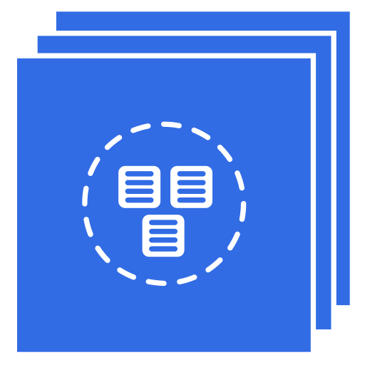 <b>Pods</b></a> </td>
    <td align="center"><a href="#"> <b>Pod Spec File</b></a> </td>
    <td align="center"><a href="#"> <b>Container Runtime</b></a> </td>
    <td align="center"><a href="#"> <b>Deamon</b></a> </td>
    <td align="center"><a href="#"> <b>Container Closer Look</b></a> </td>
  </tr>
</table>

## Deployment

<table>
  <tr>
    <td align="center"><a href="#">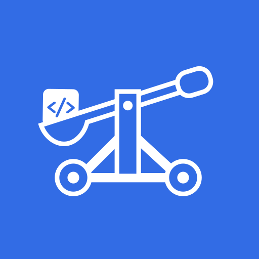 <b>Deployment</b></a> </td>
    <td align="center"><a href="#">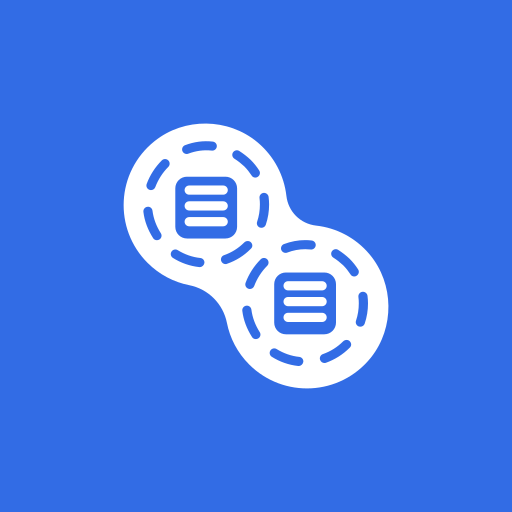 <b>Replica Set</b></a> </td>
    <td align="center"><a href="#"> <b>Stateful Set</b></a> </td>
    <td align="center"><a href="#">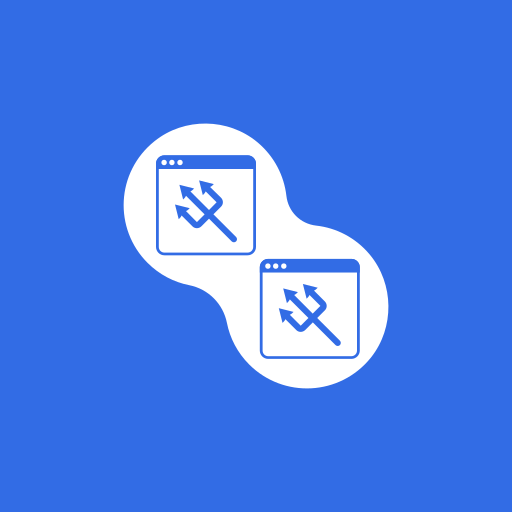 <b>Deamon Set</b></a> </td>
    <td align="center"><a href="#"> <b>Job</b></a> </td>
    <td align="center"><a href="#">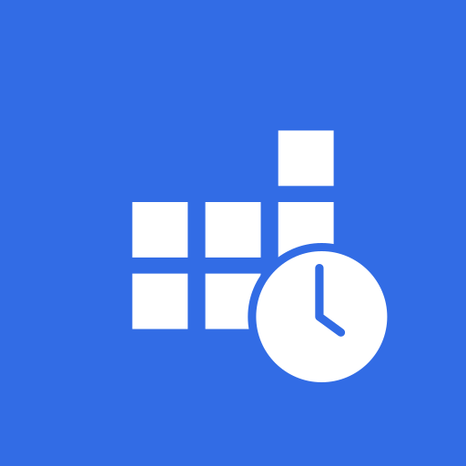 <b>Cron Job</b></a> </td>
  </tr>
</table>

<table>
  <tr>
  </tr>
</table>

## Networking

<table>
  <tr>
    <td align="center"><a href="#"> <b>Admissions Controller</b></a> </td>
    <td align="center"><a href="#"> <b>Network Policy</b></a> </td>
    <td align="center"><a href="#">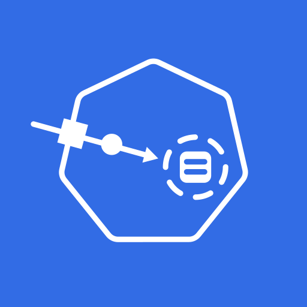 <b>Ingress</b></a> </td>
    <td align="center"><a href="#">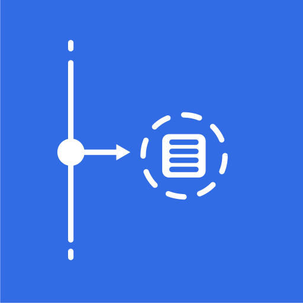 <b>Service</b></a> </td>
    <td align="center"><a href="#"> <b>Headless Service</b></a> </td>
    <td align="center"><a href="#">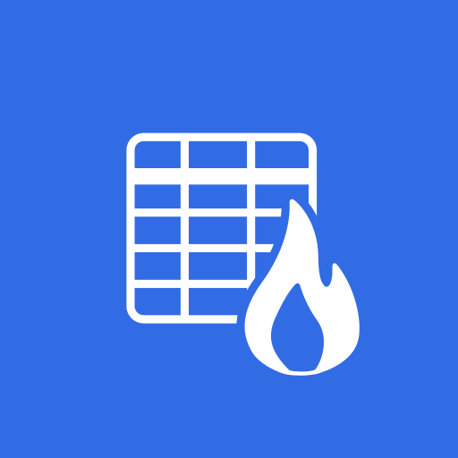 <b>Ip Tables</b></a> </td>
    <td align="center"><a href="#">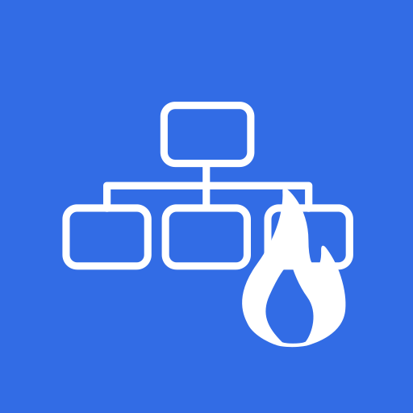 <b>IPVS</b></a> </td>
    <td align="center"><a href="#">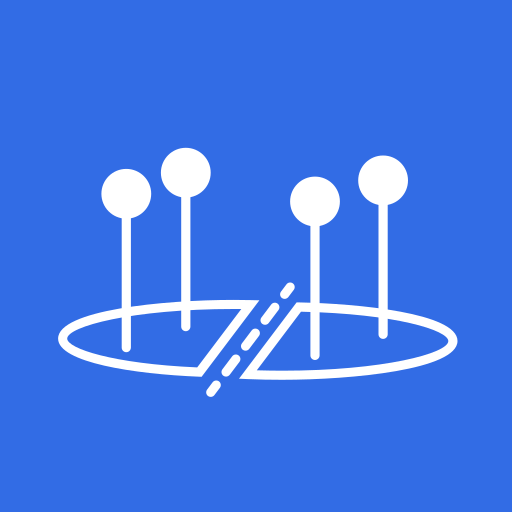 <b>Endpoint Slice</b></a> </td>
    <td align="center"><a href="#">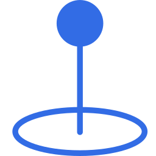 <b>Endpoint</b></a> </td>
    <td align="center"><a href="#"> <b>Proxy</b></a> </td>
  </tr>
</table>

<table>
  <tr>
    <td align="center"><a href="#">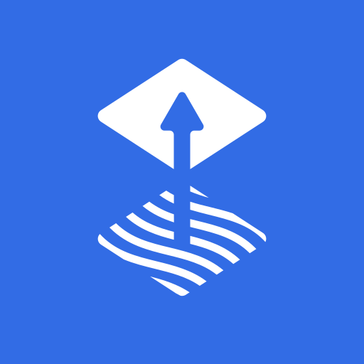 <b>Flux</b></a> </td>
    <td align="center"><a href="#"> <b>Argo</b></a> </td>
    <td align="center"><a href="#">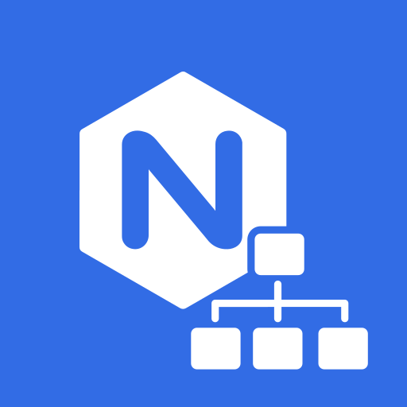 <b>Nginx Ingress Controller</b></a> </td>
  </tr>
</table>

## Storage

<table>
  <tr>
    <td align="center"><a href="#"> <b>Core DNS</b></a> </td>
    <td align="center"><a href="#"> <b>Persistent Volume Claim</b></a> </td>
    <td align="center"><a href="#"> <b>Persistent Volume</b></a> </td>
    <td align="center"><a href="#"> <b>Ephemeral Storage</b></a> </td>
    <td align="center"><a href="#">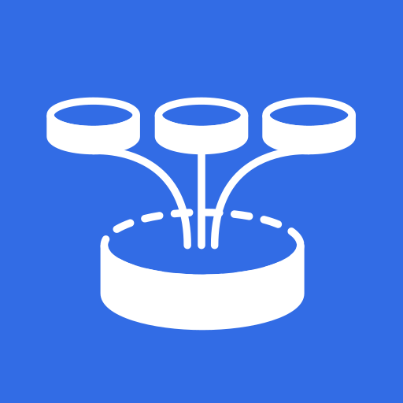 <b>Projected Volume</b></a> </td>
    <td align="center"><a href="#"> <b>Volume Snapshot</b></a> </td>
    <td align="center"><a href="#">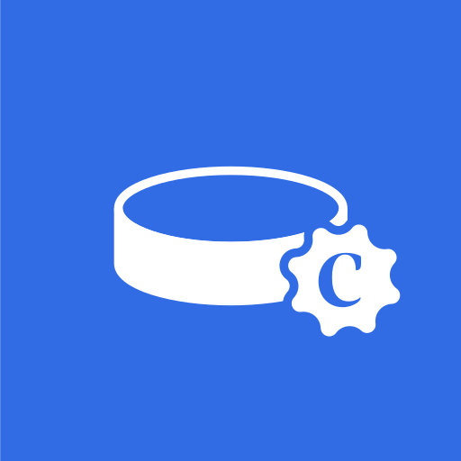 <b>Storage Class</b></a> </td>
    <td align="center"><a href="#"> <b>Secrets</b></a> </td>
    <td align="center"><a href="#"> <b>Config Map</b></a> </td>
    <td align="center"><a href="#"> <b>Etcd</b></a> </td>
  </tr>
</table>

## Role Based Access Controls (RBAC)
<table>
  <tr>
    <td align="center"><a href="#"> <b>Role</b></a> </td>
    <td align="center"><a href="#"> <b>Role Binding</b></a> </td>
    <td align="center"><a href="#">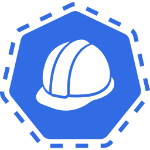 <b>Cluster Role</b></a> </td>
    <td align="center"><a href="#"> <b>Cluster Role Binding</b></a> </td>
    <td align="center"><a href="#"> <b>Service Account</b></a> </td>
    <td align="center"><a href="#"> <b>User</b></a> </td>
    <td align="center"><a href="#"> <b>Group</b></a> </td>
  </tr>
</table>

## Open Standards

<table>
  <tr>
    <td align="center"><a href="#">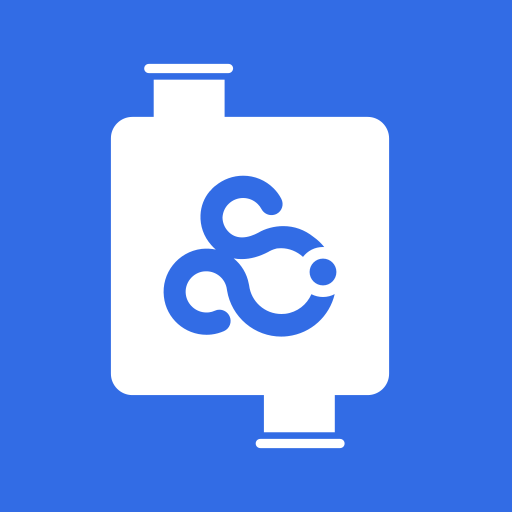 <b>Container Storage Interface</b></a> </td>
    <td align="center"><a href="#">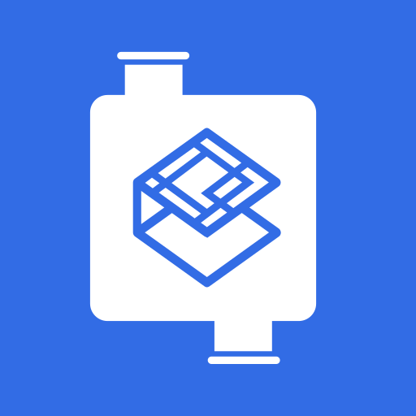 <b>Container Network Interface</b></a> </td>
    <td align="center"><a href="#"> <b>Container Runtime Interface (ContainerD)</b></a> </td>
    <td align="center"><a href="#">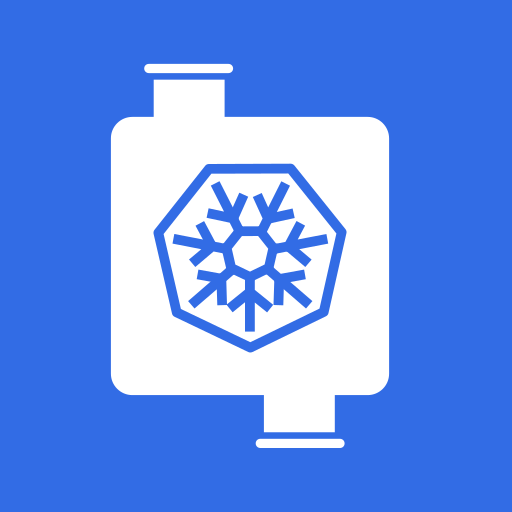 <b>Container Runtime Interface (CRI-O)</b></a> </td>
  </tr>
</table>

## Autoscaling and Limits

<table border="0">
  <tr><td width="1%" align="center"><a href="#">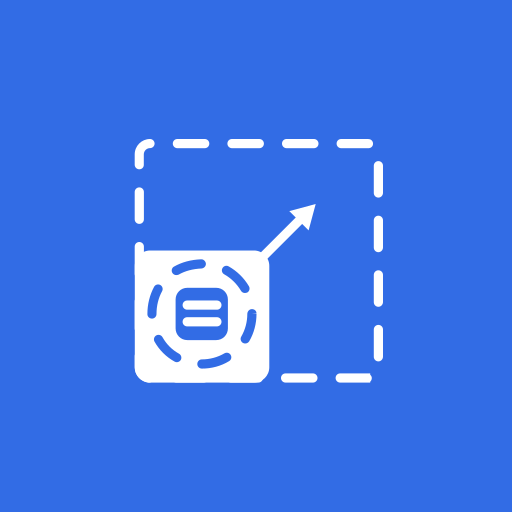</tr><tr><b>Vertical Pod Autoscaler</b></a> </td></tr>
  <tr><td width="1%" align="center"><a href="#">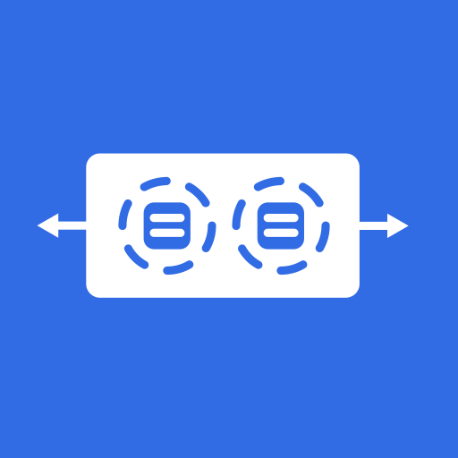</tr><tr><b>Horizontal Pod Autoscaler</b></a> </td></tr>
  <tr><td width="1%" align="center"><a href="#">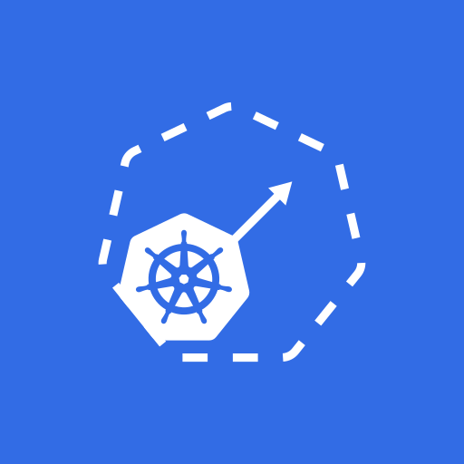</tr><tr><b>Cluster Autoscaler</b></a> </td></tr>
  <tr><td width="1%" align="center"><a href="#">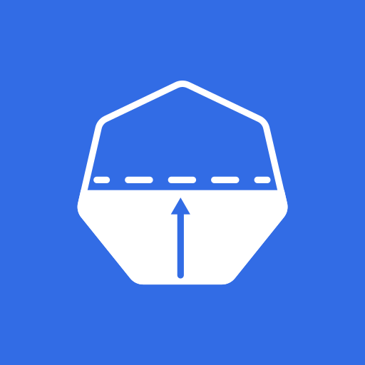</tr><tr><b>Limit Range</b></a> </td></tr>
  <tr><td width="1%" align="center"><a href="#">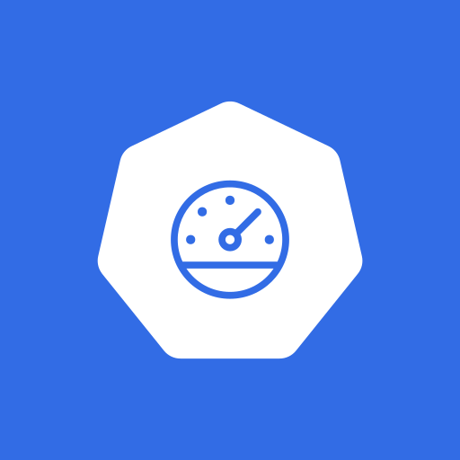</tr><tr><b>Resource Quotas</b></a> </td></tr>
</table>

## Kubelet

<table>
  <tr>
    <td align="center"><a href="#"> <b>Kubelet</b></a> </td>
    <td align="center"><a href="#"> <b>Readiness Probe</b></a> </td>
    <td align="center"><a href="#"> <b>Liveness Probe</b></a> </td>
    <td align="center"><a href="#">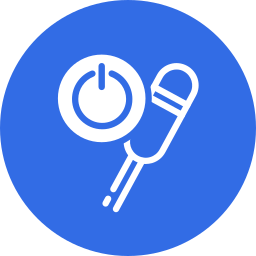 <b>Startup Probe</b></a> </td>
  </tr>
</table>

