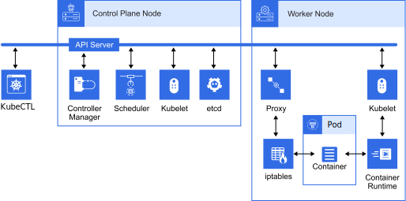
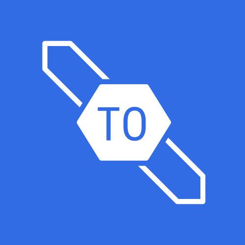

# Kubernetes Architecture Icons

A K8s and Cloud-Native icon set for building cloud-native architecture diagrams

# Download Icons

You can download all icons as a single zip archive (Choose your format):

- [PNGs 512px](https://github.com/ExamProCo/Kubernetes-Architecture-Icons/releases/download/1.0.0/k8s-icons-1.0.0-png-512px.zip)
- [PNGs 256px](https://github.com/ExamProCo/Kubernetes-Architecture-Icons/releases/download/1.0.0/k8s-icons-1.0.0-png-256px.zip)
- [PNGs 128px](https://github.com/ExamProCo/Kubernetes-Architecture-Icons/releases/download/1.0.0/k8s-icons-1.0.0-png-128px.zip)
- [PNGs 64px](https://github.com/ExamProCo/Kubernetes-Architecture-Icons/releases/download/1.0.0/k8s-icons-1.0.0-png-64px.zip)
- [SVGs](https://github.com/ExamProCo/Kubernetes-Architecture-Icons/releases/download/1.0.0/k8s-icons-1.0.0-svg.zip)

Latest and previous downloadable archive versions can found on the [releases page](https://github.com/ExamProCo/Kubernetes-Architecture-Icons/releases)

# Included Tools

- How to use the [SVG-to-PNG Conversion tool](docs/tools/svg-to-png.md) (supports any custom size)
- How to use the [Package Release tool](docs/tools/package-release.md) to aid in publishing new releases

# Included Files

- How to use the original [Illustrator file](docs/files/k8-architecture-icons.md) for mass svg export or to add your own icon.

# Icon Directory

## Cluster and Node Management

<table>
  <tr>
    <td></td>
    <td><a href="docs/cluster.md">Cluster</a></td>
  </tr>
  <tr>
    <td></td>
    <td><a href="docs/controller-manager.md">Controller Manager</a></td>
  </tr>
  <tr>
    <td></td>
    <td><a href="docs/cloud-controller-manager.md">Cloud Controller Manager</a></td>
  </tr>
  <tr>
    <td></td>
    <td><a href="docs/control-plane-node.md">Control Plane Node</a></td>
  </tr>
  <tr>
    <td></td>
    <td><a href="docs/worker-node.md">Worker Node</a></td>
  </tr>
  <tr>
    <td></td>
    <td><a href="docs/custom-resource-definition.md">Custom Resource Defintion</a></td>
  </tr>
  <tr>
    <td></td>
    <td><a href="docs/namespace.md">Namespace</a></td>
  </tr>
  <tr>
    <td></td>
    <td><a href="docs/scheduler.md">Scheduler</a></td>
  </tr>
  <tr>
    <td></td>
    <td><a href="docs/kustomize.md">Kustomize</a></td>
  </tr>
  <tr>
    <td></td>
    <td><a href="docs/helm.md">Helm</a></td>
  </tr>
  <tr>
    <td></td>
    <td><a href="docs/operator.md">Operator</a></td>
  </tr>
  <tr>
    <td></td>
    <td><a href="docs/kubeadm.md">Kubeadm</a></td>
  </tr>
  <tr>
    <td></td>
    <td><a href="docs/taint.md">Taint</a></td>
  </tr>
  <tr>
    <td></td>
    <td><a href="docs/toleration.md">Toleration</a></td>
  </tr>
</table>

## API

<table>
  <tr>
    <td></td>
    <td><a href="docs/api-server.md">API Server</a></td>
  </tr>
  <tr>
    <td></td>
    <td><a href="docs/kube-ctl.md">Kube CTL</a></td>
  </tr>
  <tr>
    <td></td>
    <td><a href="docs/generic-manifest-file.md">Generic Mainfest File</a></td>
  </tr>
</table>

## Containers and Pods

<table>
  <tr>
    <td></td>
    <td><a href="docs/container.md">Container</a></td>
  </tr>
  <tr>
    <td></td>
    <td><a href="docs/pod.md">Pod</a></td>
  </tr>
  <tr>
    <td></td>
    <td><a href="docs/pods.md">Pods</a></td>
  </tr>
  <tr>
    <td></td>
    <td><a href="docs/pod-spec-file.md">Pod Spec File</a></td>
  </tr>
  <tr>
    <td></td>
    <td><a href="docs/container-runtime.md">Container Runtime</a></td>
  </tr>
  <tr>
    <td></td>
    <td><a href="docs/deamon.md">Deamon</a></td>
  </tr>
  <tr>
    <td></td>
    <td><a href="docs/container-close-look.md">Container Close Look</a></td>
  </tr>
</table>

## Deployment

<table>
  <tr>
    <td></td>
    <td><a href="docs/deployment.md">Deployment</a></td>
  </tr>
  <tr>
    <td></td>
    <td><a href="docs/replica-set.md">Replica Set</a></td>
  </tr>
  <tr>
    <td></td>
    <td><a href="docs/stateful-set.md">Stateful Set</a></td>
  </tr>
  <tr>
    <td></td>
    <td><a href="docs/deamon-set.md">Deamon Set</a></td>
  </tr>
  <tr>
    <td></td>
    <td><a href="docs/cron-job.md">Cron Job</a></td>
  </tr>
  <tr>
    <td></td>
    <td><a href="docs/job.md">Job</a></td>
  </tr>
  <tr>
    <td></td>
    <td><a href="docs/rollout.md">Rollout</a></td>
  </tr>
</table>

## Networking

<table>
  <tr>
    <td></td>
    <td><a href="docs/admissions-controller.md">Admissions Controller</a></td>
  </tr>
  <tr>
    <td></td>
    <td><a href="docs/network-policy.md">Network Policy</a></td>
  </tr>
  <tr>
    <td></td>
    <td><a href="docs/ingress.md">Ingress</a></td>
  </tr>
  <tr>
    <td></td>
    <td><a href="docs/service.md">Service</a></td>
  </tr>
  <tr>
    <td></td>
    <td><a href="docs/headless-service.md">Headless Service</a></td>
  </tr>
  <tr>
    <td></td>
    <td><a href="docs/ip-tables.md">IP Tables</a></td>
  </tr>
  <tr>
    <td></td>
    <td><a href="docs/ipvs.md">IPVS</a></td>
  </tr>
  <tr>
    <td></td>
    <td><a href="docs/endpoint-slice.md">Endpoint Slice</a></td>
  </tr>
  <tr>
    <td></td>
    <td><a href="docs/endpoint.md">Endpoint</a></td>
  </tr>
  <tr>
    <td></td>
    <td><a href="docs/proxy.md">Proxy</a></td>
  </tr>
  <tr>
    <td></td>
    <td><a href="docs/gateway-api.md">Gateway API</a></td>
  </tr>
</table>

<table>
  <tr>
    <td></td>
    <td><a href="docs/flux.md">Flux</a></td>
  </tr>
  <tr>
    <td></td>
    <td><a href="docs/argo.md">Argo</a></td>
  </tr>
  <tr>
    <td></td>
    <td><a href="docs/nginx-ingress-controller.md">Nginx Ingress Controller</a></td>
  </tr>
</table>

## Storage

<table>
  <tr>
    <td></td>
    <td><a href="docs/core-dns.md">Core DNS</a></td>
  </tr>
  <tr>
    <td></td>
    <td><a href="docs/persistent-volume-claim.md">Persistent Volume Claim</a></td>
  </tr>
  <tr>
    <td></td>
    <td><a href="docs/persistent-volume.md">Persistent Volume</a></td>
  </tr>
  <tr>
    <td></td>
    <td><a href="docs/ephemeral-storage.md">Ephemeral StoragP</a></td>
  </tr>
  <tr>
    <td></td>
    <td><a href="docs/projected-volume.md">Projected Volum</a></td>
  </tr>
  <tr>
    <td></td>
    <td><a href="docs/volume-snapshot.md">Volume Snapshot</a></td>
  </tr>
  <tr>
    <td></td>
    <td><a href="docs/storage-class.md">Storage Class</a></td>
  </tr>
  <tr>
    <td></td>
    <td><a href="docs/secrets.md">Secrets</a></td>
  </tr>
  <tr>
    <td></td>
    <td><a href="docs/config-map.md">Config Map</a></td>
  </tr>
  <tr>
    <td></td>
    <td><a href="docs/etcd.md">Etcd</a></td>
  </tr>
</table>

## Role Based Access Controls (RBAC)
<table>
  <tr>
    <td></td>
    <td><a href="docs/role.md">Role</a></td>
  </tr>
  <tr>
    <td></td>
    <td><a href="docs/role-binding.md">Role Binding</a></td>
  </tr>
  <tr>
    <td></td>
    <td><a href="docs/cluster-role.md">Cluster Role</a></td>
  </tr>
  <tr>
    <td></td>
    <td><a href="docs/cluster-role-binding.md">Cluster Role Binding</a></td>
  </tr>
  <tr>
    <td></td>
    <td><a href="docs/service-account.md">Service Account</a></td>
  </tr>
  <tr>
    <td></td>
    <td><a href="docs/user.md">User</a></td>
  </tr>
  <tr>
    <td></td>
    <td><a href="docs/group.md">Group</a></td>
  </tr>
  <tr>
    <td></td>
    <td><a href="docs/kubeconfig.md">kubeconfig</a></td>
  </tr>
</table>

## Public Key Infrastructure (PKI)
<table>
  <tr>
    <td></td>
    <td><a href="docs/server-certificate.md">Server Certificate</a></td>
  </tr>
</table>

## Open Standards

<table>
  <tr>
    <td></td>
    <td><a href="docs/container-storage-interface.md">Container Storage Interface</a></td>
  </tr>
  <tr>
    <td></td>
    <td><a href="docs/container-network-interface.md">Container Network Interface</a></td>
  </tr>
  <tr>
    <td></td>
    <td><a href="docs/container-runtime-interface-container-d.md">Container Runtime Interface (ContainerD)</a></td>
  </tr>
  <tr>
    <td></td>
    <td><a href="docs/container-runtime-interface-cri-o.md">Container Runtime Interface (CRI-O)</a></td>
  </tr>
</table>

## Autoscaling and Limits

<table>
  <tr>
    <td></td>
    <td><a href="docs/vertical-pod-autoscaler.md">Vertical Pod Autoscaler</a></td>
  </tr>
  <tr>
    <td></td>
    <td><a href="docs/horizontal-pod-autoscaler.md">Horizontal Pod Autoscaler</a></td>
  </tr>
  <tr>
    <td></td> 
    <td><a href="docs/cluster-autoscaler.md">Cluster Autoscaler</a></td>
  </tr>
  <tr>
    <td></td>
    <td><a href="docs/requests.md">Requests</a></td>
  </tr>
  <tr>
    <td></td>
    <td><a href="docs/limit-range.md">Limit Range</a></td>
  </tr>
  <tr>
    <td></td>
    <td><a href="docs/resource-quotas.md">Resource Quotas</a></td>
  </tr>
</table>

## Kubelet

<table>
  <tr>
    <td></td>
    <td><a href="docs/kubelet.md">Kubelet</a></td>
  </tr>
  <tr>
    <td></td>
    <td><a href="docs/readiness-probe.md">Readiness Probe</a></td>
  </tr>
  <tr>
    <td></td> 
    <td><a href="docs/liveness-probe.md">Liveness Probe</a></td>
  </tr>
  <tr>
    <td></td>
    <td><a href="docs/startup-probe.md">Startup Probe</a></td>
  </tr>
</table>
